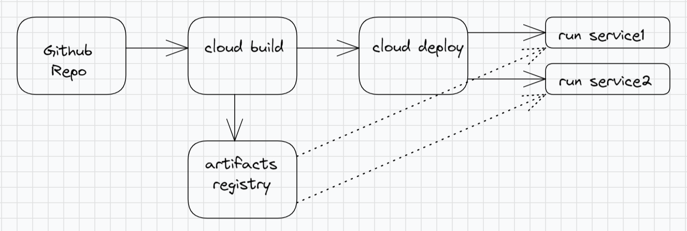

# 01-cb-cd-cloud-run



This terraform code will create a manual cloud build trigger and cloud deploy pipeline/targets.

Step 1 : Fork this repository and connect to cloud build service

https://cloud.google.com/build/docs/automating-builds/github/connect-repo-github#terraform_1

Step 2 : Update the variable.auto.tfvars with project id. If the source and target project are same, update same in both the project ids variables.

NOTE: If source and target project are not same, then disable `constraints/iam.disableCrossProjectServiceAccountUsage` organization policy on the target project.

Step 3 : Initialize Terraform

```BASH
terraform init
```

Step 4 : Terraform plan

```BASH
terraform plan
```

Step 5 : Terraform apply

```BASH
terraform apply
```

Step 6 : Terraform destroy

```BASH
terraform destroy
```
